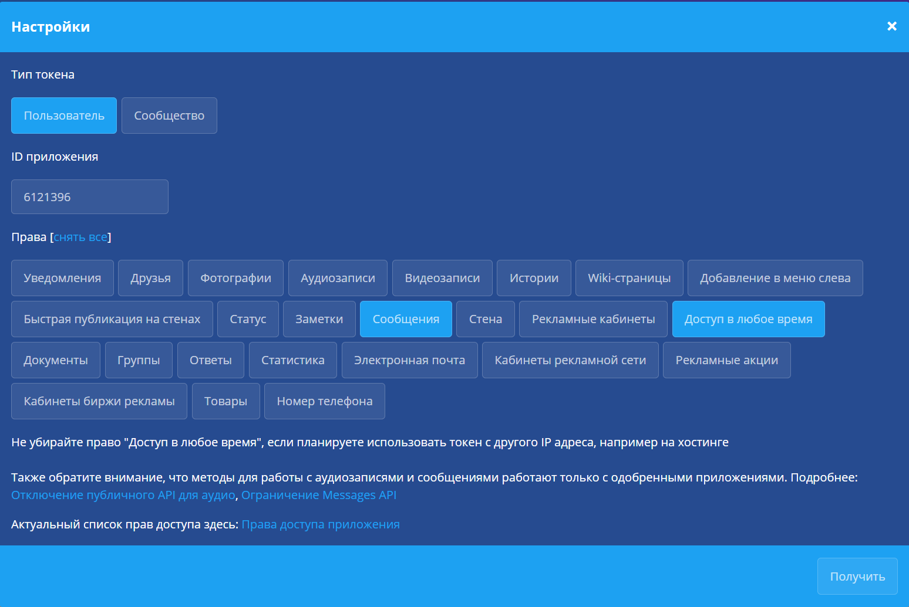
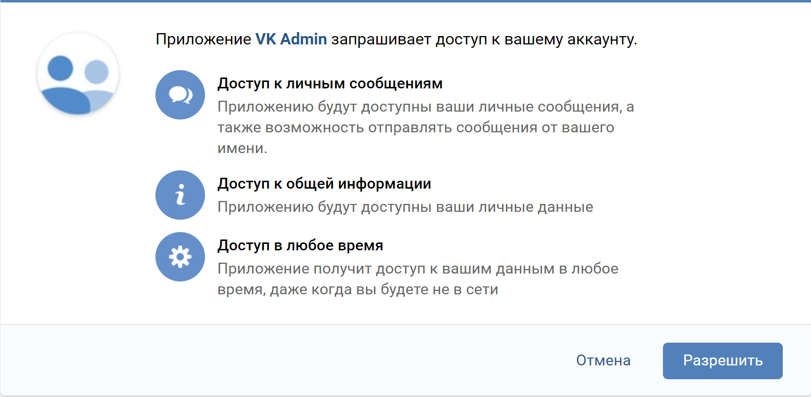

# Simple Bot for chat VK

## Setup intruction

### Install Required Python Modules
``
pip install -r requirements.txt
``
## Functional
- Sending some polls in chat VK

#### Command for instruction:
- "#help" or "#хелп" or "#помощь"

#### How to set token in project:

- Go to [page](https://vkhost.github.io) and click "Settings":
- You will see the window, select items  and click "get":

- Click "get" and click "Allow":

- Copy part of address bar from **access_token=** to **&expires_in**

- Create file "token.txt" in project directory

- Past the string in the file "token.txt"
